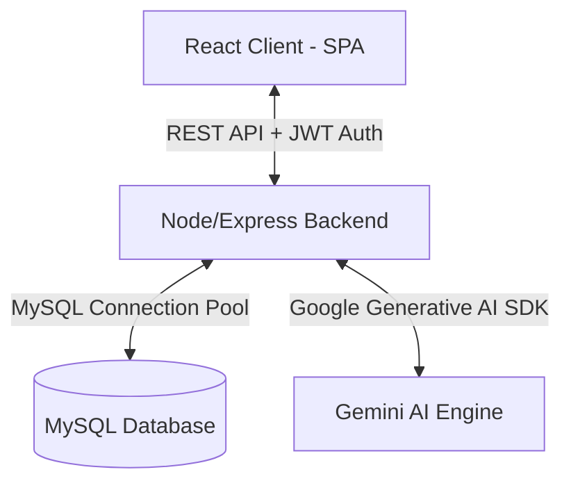

# 🤖 SQL Tutor Bot - Interactive AI-Powered SQL Learning Platform

[](LICENSE)
[](https://react.dev)
[](https://vitejs.dev)
[](https://nodejs.org)
[](https://tailwindcss.com)
[](https://makeapullrequest.com)

SQL Tutor Bot is a comprehensive, modern web application designed to help users master SQL interactively. The platform features an AI-powered tutoring chatbot, a live SQL execution playground, a smart syntax debugger, gamified practice challenges, and a detailed learning progress dashboard.

With both a simulated **Mock Data Mode** and a live **MySQL Database Mode**, users can learn and practice SQL securely in any environment.

---

## 🚀 Key Features

*   **💬 AI SQL Tutor (Chat)**: Ask database and SQL questions, get structured breakdowns, generate safe SQL queries, and explore step-by-step query explanations generated by Gemini.
*   **🛝 Interactive SQL Playground**: Write and run standard `SELECT`, `SHOW`, `DESCRIBE`, and `EXPLAIN` queries directly against a live database. Visualize execution timings and result sets instantly.
*   **🔍 Smart SQL Debugger**: Troubleshoot broken SQL. Paste your query, view detailed visual error annotations, and let the AI automatically rewrite/fix the query for you.
*   **🏆 Gamified Practice Challenges**: Solve real-world database queries ranging from Easy to Hard. Verify your queries by matching execution results against expected outputs.
*   **📚 Syllabus & Topic Quizzes (Learn)**: Work through structured modules starting from basic queries up to complex Subqueries, Indexing, and JOINs. Complete quizzes at the end of each module to test your knowledge.
*   **📊 Progress & Analytics Dashboard**: Monitor your learning journey, view quiz scores, study duration, challenge completion rates, and track your topic-wise mastery with charts powered by Recharts.
*   **⚙️ Flexible Settings**: Easily toggle between local mock data and a live MySQL server connection. Manage Gemini API keys, view active database connections, and control user profiles.

---

## 🏗️ Architecture Overview

The application follows a classic client-server monorepo architecture:



1.  **Frontend SPA**: A React application built with TypeScript and Vite. It manages state locally using React Contexts (e.g. ChatContext) and handles layout routing using React Router. Styling is optimized with Tailwind CSS (v4) and animations are powered by Framer Motion.
2.  **Backend REST API**: An Express application using Node.js. It manages authorization using JSON Web Tokens (JWT), hashes passwords with `bcryptjs`, and validates inputs with Express Validator.
3.  **Database Layer**: MySQL stores persisting data for users, chats, messages, and progress (quizzes & challenges). It executes safe query executions under a connection pool using `mysql2`.
4.  **AI Engine Integration**: Google Gemini API integration leverages `gemini-2.5-flash-lite` to parse natural language requests, outputting structured JSON tutoring payloads containing answers, suggested queries, explanations, and result previews.

---

## 🛠️ Tech Stack

### Frontend
*   **Framework**: React (v18)
*   **Build Tool**: Vite (v6)
*   **Language**: TypeScript
*   **Styling**: Tailwind CSS (v4), Radix UI (Accordion, Dialog, Tabs, tooltips), Material UI Icons, Lucide Icons
*   **Charts & Visuals**: Recharts (v2) for progress visualization
*   **Animations**: Framer Motion (`motion` v12), Canvas Confetti

### Backend
*   **Runtime**: Node.js (>= 18.x)
*   **Framework**: Express (v4)
*   **Database Client**: MySQL2 (with promise pools)
*   **Authentication**: JWT (`jsonwebtoken` v9), `bcryptjs` (v2) for security
*   **AI Integration**: `@google/generative-ai` SDK (v0.24.1)

---

## 📂 Project Directory Structure

```text
sql-tutor-bot/
├── backend/
│   ├── config/             # Database connection & schema scripts
│   │   ├── db.js           # MySQL connection pool configuration
│   │   └── schema.sql      # Database initialization schema
│   ├── controllers/        # Express request handling logic
│   │   ├── authController.js    # Sign Up, Sign In, Profile
│   │   ├── chatController.js    # Chat history and room management
│   │   ├── messageController.js # Message exchange & Gemini invocation
│   │   └── sqlController.js     # SQL Playground verification & execution
│   ├── middleware/         # Custom routes middleware
│   │   └── authMiddleware.js    # Token authentication check
│   ├── models/             # Database queries & models (User, Chat, Message)
│   ├── routes/             # Express API routing mappings
│   ├── services/           # AI helper functions (Gemini Integration)
│   ├── utils/              # Helper utilities
│   ├── app.js              # Server bootstrapper & listener
│   └── package.json
│
├── frontend/
│   ├── src/
│   │   ├── app/
│   │   │   ├── components/ # Layout structures (AppLayout, LandingPage, Login)
│   │   │   ├── pages/      # Workspace modules (Chat, Learn, Playground, Debugger, Practice, Progress, Settings)
│   │   │   └── routes.tsx  # React Router paths configuration
│   │   ├── components/     # Atomic UI components
│   │   ├── context/        # React Context stores
│   │   ├── main.tsx        # React entry point mounting the router
│   │   └── styles/         # Global stylesheets
│   └── package.json
│
└── Premium SaaS Landing Page Design (1)/  # Original Figma UI client template reference
```

---

## ⚙️ Installation & Setup

### Prerequisites
*   [Node.js](https://nodejs.org/) (>= 18.x recommended)
*   [MySQL Server](https://www.mysql.com/) (running on port 3306)
*   Google Gemini API Key (get one from [Google AI Studio](https://aistudio.google.com/))

---

### Step 1: Database Setup (MySQL)
1.  Log into your local MySQL CLI or administrative GUI (e.g., MySQL Workbench).
2.  Initialize the database tables by executing the database schema:
    ```bash
    mysql -u root -p < backend/config/schema.sql
    ```

---

### Step 2: Backend Setup
1.  Navigate to the backend directory:
    ```bash
    cd backend
    ```
2.  Install the server packages:
    ```bash
    npm install
    ```
3.  Create a `.env` file based on the example:
    ```bash
    cp .env.example .env
    ```
4.  Configure the `.env` variables:
    ```env
    PORT=5000
    NODE_ENV=development

    # Database Configuration
    DB_HOST=127.0.0.1
    DB_PORT=3306
    DB_USER=root
    DB_PASSWORD=your_mysql_password
    DB_NAME=sql_tutor_bot

    # Authentication Secret
    JWT_SECRET=your_super_secret_jwt_key_change_in_production
    JWT_EXPIRE=7d

    # Google Gemini API
    GEMINI_API_KEY=AIzaSy...your_gemini_api_key...
    GEMINI_MODEL=gemini-2.5-flash-lite

    # Cors Settings
    CORS_ORIGIN=http://localhost:5173
    ```
5.  Launch the Express server in development mode:
    ```bash
    npm run dev
    ```

---

### Step 3: Frontend Setup
1.  Navigate to the frontend directory:
    ```bash
    cd ../frontend
    ```
2.  Install client dependencies:
    ```bash
    npm install
    ```
3.  Verify your `.env` configuration contains:
    ```env
    VITE_API_URL=http://localhost:5000/api
    ```
4.  Boot up the client server:
    ```bash
    npm run dev
    ```
    *Open [http://localhost:5173](http://localhost:5173) in your browser to view the application.*

---

## 🔒 Security & Query Sandboxing

To protect data and system integrity, the SQL Playground enforces strict rules:
*   **Permitted Operations**: Read-only statements (`SELECT`, `SHOW`, `DESCRIBE`, `DESC`, `EXPLAIN`).
*   **Blocked Actions**: Modifying statements (`DROP`, `DELETE`, `UPDATE`, `ALTER`, `TRUNCATE`, `INSERT`, `CREATE`, `GRANT`).
*   **Injection Protections**: Block comments (`--`, `/*`, `#`) and multi-statement queries (separated by `;`) are rejected.

---

## 📝 API Documentation

### Auth Endpoints
*   `POST /api/auth/register` - Creates a user account.
*   `POST /api/auth/login` - Validates email/password credentials and issues a JWT token.
*   `GET /api/auth/profile` - Fetches the authenticated user profile. (Requires JWT)

### Chat & Message Endpoints (Requires JWT)
*   `POST /api/chat/new` - Starts a new chat thread.
*   `GET /api/chat/history` - Fetches user's chat history logs.
*   `GET /api/chat/:id/messages` - Gets all messages from a single chat room.
*   `PUT /api/chat/:id/rename` - Updates the title of a chat conversation.
*   `DELETE /api/chat/:id` - Deletes a chat thread.
*   `POST /api/message/send` - Submits a prompt, receives the user message record, triggers the Gemini Tutor Agent, and saves/returns the structured tutoring response.

### SQL Sandbox Endpoints (Requires JWT)
*   `POST /api/sql/run` - Safely executes validated read-only queries against the database connection pool.
*   `POST /api/sql/explain` - Queries the AI Tutor to generate explanations for raw SQL snippets.
*   `GET /api/sql/quiz` - Fetches topic-wise study questions.

---

## 📸 Screenshots

| Landing Page | Interactive Chat Tutor |
|---|---|
|  |  |

| SQL Playground | Progress Dashboard |
|---|---|
|  |  |

---

## 🔮 Future Roadmap

*   [ ] **Visual Schema Builder**: Build and interact with database diagrams visually.
*   [ ] **Multiple Engine Support**: Toggle execution engines between MySQL, PostgreSQL, SQLite, and Microsoft SQL Server.
*   [ ] **Gamified Streaks & Badges**: Persist achievements, challenge completions, and learning paths.
*   [ ] **Interactive SQL Debugger Integration**: Fully hook the client-side SQL Debugger module into the Gemini backend to analyze syntax errors dynamically.
*   [ ] **Shared Playgrounds**: Share database playground instances and challenges with other users.

---

## 🤝 Contributing

Contributions are welcome! Please follow these guidelines:
1.  Fork the Project.
2.  Create your Feature Branch (`git checkout -b feature/AmazingFeature`).
3.  Commit your Changes (`git commit -m 'Add some AmazingFeature'`).
4.  Push to the Branch (`git push origin feature/AmazingFeature`).
5.  Open a Pull Request.

---

## 📜 License

This project is licensed under the [ISC License](LICENSE).

---

## 👤 Author

*   **Your Name / GitHub Profile** - *Full Stack Developer* - [GitHub Profile](https://github.com/your-username)
